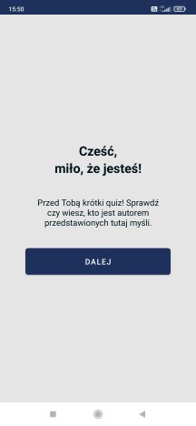
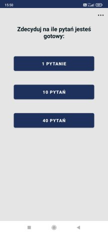
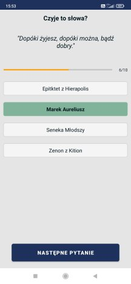
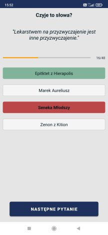
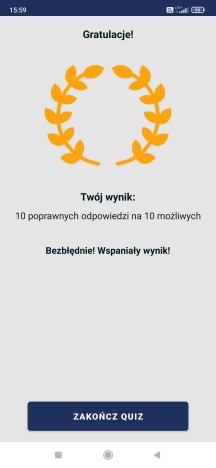
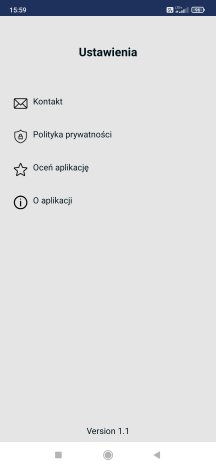
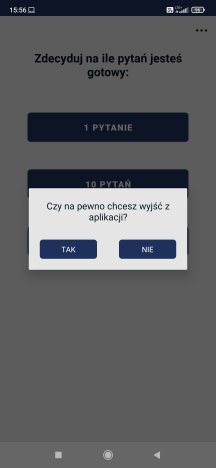

# Stoik Cytat Quiz #

You can download this app on your Android Device:
[Google Play Store](https://play.google.com/store/apps/details?id=pl.glownia.maciej.stoikcytatquiz&hl=pl)
---
### Goal ### 
Create an app which let user test their knowledge about popular thoughts of stoics.
Application is in polish language.
This app contains thoughts of 4 stoics: Epictetus from Hierapolis, Marcus Aurelius, 
Seneca the Younger and Zeno of Citium.

### Screenshots ###

##### Overview: #####
1. First activity is to welcome user, 
2. Second activity is to let user choose if they want to draw 1, 10 or 40 quotes.
   This layout also contains 3 dots button to settings area,
3. Then in next activity user can find question/s based on thoughts and four possible answer 
   to check. Good and bad answer is highlight in different color. If user chosen wrong answer 
   there also good answer will be displayed,
4. This layout also contain progress bar to show user which question actually is 
   and how many is in total,
5. Application requires to check one of answer to go to the next question,
6. If user press back button there is dialog to protect before accidentally finish the quiz,   
7. At the end there is result activity were trophy is waiting for user. Also there is result 
   of they answers (counted) related to total number of questions.
8. Last option for user is to finish quiz.
9. Quotes I keep in HashMap.
10. There is also settings activity when user can (after click 3 dots in second activity):
   a) send mail to developer,
   b) read privacy policy,
   c) rate app in the google store,
   d) read description about application,
   e) check the version of app - available at the bottom of layout.

Of course there is space to develop this app for different features.

### To start this app ###
1. Clone this project,
2. Open Android Studio,
3. Select File -> Open... -> choose this project from path where you cloned it,
4. Set Gradle: File -> Settings -> Build, Execution, Deployment -> Gradle
   -> Gradle JDK: set up for 1.8 (if it is necessary),
5. Run the application.

### Requirements: ###
1. Android Studio ArcticFox (2020.3.1) Stable,
2. Minimal Sdk: 21 Recommended: 32.
3. Size of device - recommended minimum 5.00"

### What I have learned during this project? ###
1. I should write README.md up to date -> now it is difficult to put everything in nice order
   with more details and also with thoughts which I had in various points during develop this app,
2. How to set up:
   - program buttons to work in different goal,
   - layouts,
   - back button,
   - gradle,
   - intent to send mail to developer,
3. How to add:
   - different functionality as drawable, buttons, textViews etc.
   - dialog (alert dialog) when user click back button
4. Important elements and functions, as:
   - make working all buttons and text view,
   - cardView,
   - data class,
   - constants,
   - progress bar,
   - object - special class,
   - setOnClickListener()
   - intent and passing data to next activity,
   - passing and retrieving data via intent  
   - part of collections,
   - null safety,
   - generate privacy policy,
5. Publish application on Play Store
6. I should test application more carefully before publish it. Also ask other developers for help 
   to test it. Then there is a chance that someone will take a fresh look at the application 
   and it helps avoid bugs.
   
### Links (to say "Thank you!" for others job): ###

- [Denis Panjuta](https://tutorials.eu/)
- [Flaticon - free icons](https://www.flaticon.com/free-icons/android) [Image sources](https://github.com/maciejglownia/StoikCytatQuiz/blob/master/app/src/main/assets/sources.txt)
- [Privacy policy generator](https://app-privacy-policy-generator.firebaseapp.com/)
- [Norio - graphic generator](https://www.norio.be/graphic-generator/)

### Dear Visitor ###

If you see an opportunity to improve my code do not hesitate to contact me: maciej.k.glownia@gmail.com. 
If you want to copy it and develop with your own idea, take it and enjoy learning path.

### Summary ###
There are many concepts, more of them I saw first time. They need to be repeat to understand them 
better, but I used many lines of comments to write down explanation to understand, as good as 
possible, what happen in this code, which functions are responsible for, and also why some concepts 
I should use in these case.