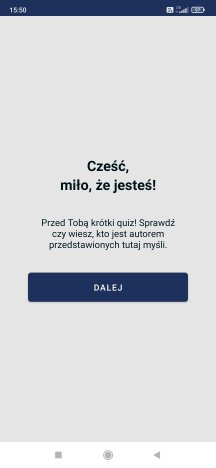
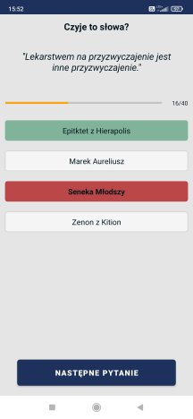
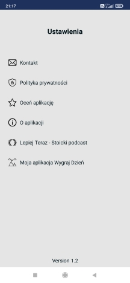
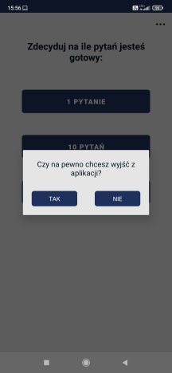

# Stoik Cytat Quiz #

You can download this app on your Android Device:
// todo add the link when the app is deployed
[Google Play Store]()
---

### Goal ### 

Create an app that lets users test their knowledge about popular thoughts of stoics.
The application is in Polish language.
This app contains thoughts of 4 stoics: Epictetus from Hierapolis, Marcus Aurelius,
Seneca the Younger and Zeno of Citium.

### Screenshots ###

##### Overview: #####

1. The first activity is to welcome the user,
2. The second activity lets users draw 1, 10, or 40 quotes,
   This layout also contains 3 dots button to the settings area,
3. In the next activity, the user can find question/s based on thoughts and four possible answers
   to check. Good and bad answer is highlighted in a different color. If the user chosen the wrong
   answer
   there also good answer will be displayed,
4. This layout also contains a progress bar to show the user which question is
   and how many are in total,
5. The application requires to check one of the answers to go to the next question,
6. If the user presses the back button there is a dialog to protect before accidentally finishing
   the quiz,
7. At the end there is a result activity where the trophy is waiting for the user. Also, there is
   the result
   of the answers (counted) related to the total number of questions,
8. The last option for the user is to finish the quiz,
9. Quotes I keep in HashMap,
10. There is also a settings activity when the user can (after clicking 3 dots in the second
    activity):
    a) send mail to the developer,
    b) read the privacy policy,
    c) rate the app in the Google Play Store,
    d) read the description about the application,
    e) check the version of the app - available at the bottom of the layout,
    f) visit website with content about stoicism,
    g) visit Google Play Store to get my other application "Wygraj Dzień".

There is a space to develop this app for different features.

### To start this app ###

1. Clone this project,
2. Open Android Studio,
3. Select File -> Open... -> choose this project from path where you cloned it,
4. Set Gradle: File -> Settings -> Build, Execution, Deployment -> Gradle
   -> Gradle JDK: set up for 17 (if it is necessary),
5. Run the application.

### Requirements: ###

1. Android Studio Koala 2024.1.1,
2. Minimal Sdk: 34 Recommended: 34.
3. Size of device - recommended minimum 5.00"

### What I have learned during this project? ###

1. I should write README.md up to date -> now it is difficult to put everything in nice order
   with more details and also with thoughts that I had at various points while developing this app,
2. How to set up:
    - program buttons to work on different goals,
    - layouts,
    - back button,
    - gradle,
    - intent to send mail to the developer,
3. How to add:
    - different functionality as drawables, buttons, textViews etc.,
    - dialog (alert dialog) when the user clicks the back button,
4. Important elements and functions, as:
    - make working all buttons and text view,
    - card view,
    - data class,
    - constants,
    - progress bar,
    - object - special class,
    - setOnClickListener()
    - intent and passing data to the next activity,
    - passing and retrieving data via intent
    - part of collections,
    - null safety,
    - generate privacy policy,
5. Publish the application on the Google Play Store,
6. I should test the application more carefully before publishing it. Also, ask other developers for
   help
   to test it. There is a chance that someone will take a fresh look at the application
   and it helps avoid bugs.

### Links (to say "Thank you!" for others job): ###

- [Denis Panjuta](https://tutorials.eu/)
- [Flaticon - free icons](https://www.flaticon.com/free-icons/android) [Image sources](https://github.com/maciejglownia/StoikCytatQuiz/blob/master/app/src/main/assets/sources.txt)
- [Privacy policy generator](https://app-privacy-policy-generator.firebaseapp.com/)
- [Norio - graphic generator](https://www.norio.be/graphic-generator/)
- [Lepiej Teraz - podcast Radosława Budnickiego](https://lepiejteraz.pl/)
- [Ryan Holiday](https://ryanholiday.net/)

### Dear Visitor ###

If you see an opportunity to improve my code do not hesitate to contact me:
maciej.k.glownia@gmail.com.
If you want to copy it and develop it with your idea, take it and enjoy the learning path.

### Summary ###

There are many concepts, more of them I saw the first time. They need to be repeat to understand
them
better, but I used many lines of comments to write down explanations to understand, as well as
possible, what happens in this code, which functions are responsible for, and also why some concepts
I should use it in these cases.